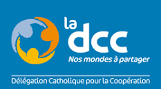
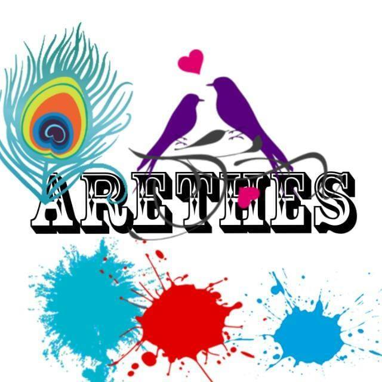

Voici une description de notre institut.

# L'histoire de l'IFNTI

L'ifnti a été fondé en 2014 par M. Sabirou TEOURI et M. Jean-Pierre PAILLART.

# Les partenaires de l'IFNTI
Voici la liste des organismes qui participe au développement de l'IFNTI.
| :-------------------------: | :-------------------------: |
|            **GIZ**              |         __Togocom__             |
|   | *logo* |
|           **La DCC**          |    __Université de Kara__       |
|   | *logo* |
|    **France Volontaires**       |      __Knowbridge University__            |
| *logo* |  |
|      **Urbis Fondation**        |            __STE__              |
| *logo* | *logo* |
|     **L'univers d'arts**        |      __Sara Consult__           |
| *logo*  | *logo* |
|         **ARETHES**           |          __ITplex__             |
|   | *logo* |

ANPE Togo
