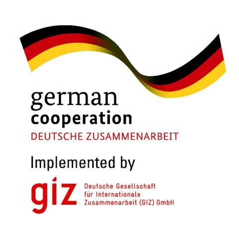

Voici une description de notre institut.

# L'histoire de l'IFNTI

L'ifnti a été fondé en 2014 par M. Sabirou TEOURI et M. Jean-Pierre PAILLART.

# Les partenaires de l'IFNTI
Voici la liste des organismes qui participe au développement de l'IFNTI.
| | |
| :-------------------------: | :-----------------------------: |
|            **GIZ**          |         __Togocom__             |
|   | *logo* |
|           **La DCC**        |    __Université de Kara__       |
|    **France Volontaires**   |    __Knowbridge University__    |
|      **Urbis Fondation**    |            __STE__              |
|          *logo*             |            *logo*               |
|     **L'univers d'arts**    |      __Sara Consult__           |
|            *logo*           |            *logo*               |
|         **ARETHES**         |          __ITplex__             |

<table>
<tbody>
<tr>
<td markdown="span"> **GIZ** </td>
<td markdown="span">  __Togocom__ </td>
</tr>
<tr>
<td markdown="span"> **La DCC** </td>
<td markdown="span">  __Université de Kara__ </td>
</tr>
  <tr>
<td markdown="span"> **France Volontaires** </td>
<td markdown="span">  __Knowbridge University__  </td>
</tr>
  <tr>
<td markdown="span"> **Urbis Fondation** </td>
<td markdown="span">  __STE__ </td>
</tr>
  <tr>
<td markdown="span"> **L'univers d'arts** </td>
<td markdown="span">  __Sara Consult__ </td>
</tr>
  <tr>
<td markdown="span"> **ARETHES** </td>
<td markdown="span">  __ITplex__ </td>
</tr>
</tbody>
</table>

ANPE Togo
